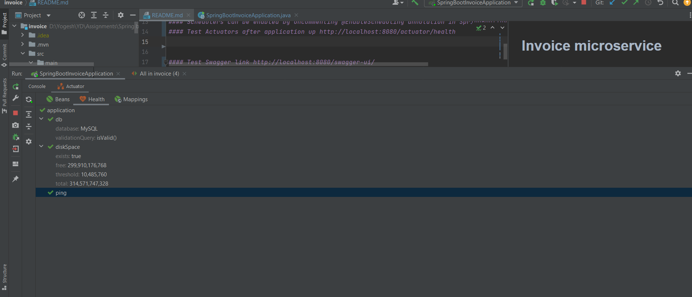
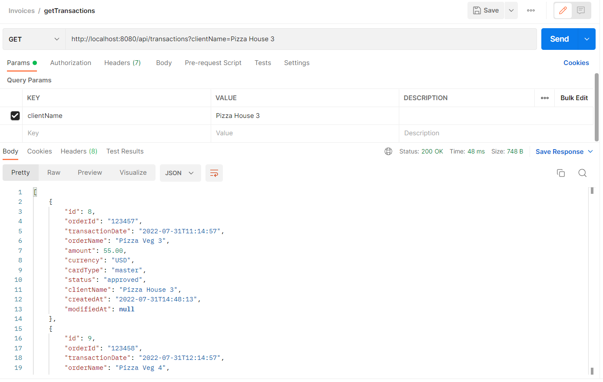

# Invoice microservice
## This service is used for generating billing invoices for given clients based on client's billing cycle, transaction status ,fees etc.
### Project Structure

### Pre requisite (Java 8 +,maven 3+ ,mysql )

### Steps
#### Clone https://github.com/ybdahe/invoice.git
#### Import as maven project
#### run mvn clean Install -DskipTests or mvn clean Install command
#### run SpringBootInvoiceApplication.java will start spring boot application on 8080 port
#### Schedulers can be enabled by uncommenting @EnableScheduling annotation in SpringBootInvoiceApplication.java
##### Schedulers cron as below

#### Test Actuators after application up http://localhost:8080/actuator/health

#### Test Swagger link http://localhost:8080/swagger-ui/

## Create Data
###1:- Create Client
#### Api :- http://localhost:8080/api/clients

###2:- Get Clients
#### Api :- http://localhost:8080/api/clients

###3:- Create Transaction
#### Api :- http://localhost:8080/api/transactions

###4:- Get Transactions
#### Api :- http://localhost:8080/api/transactions

## generate Invoice
###1:- Call http://localhost:8080/api/invoice?clientName=Pizza House 1

###1:- Call again same api with same client will give duplicate invoice error with 204 http://localhost:8080/api/invoice?clientName=Pizza House 1

### Sonar Scan result :- Zero issue left , all resolved

### Unit Test case and Code Coverage result
Note:- 61% current coverage can extend >80 %
(Due to less time not able to cover all code).

### Dockerized (see Docker file in classpath) :- Can be improved
#### docker build -t invoice.
#### docker run -p 8080:8080 -t invoice

### Postman Collection attached(see in classpath)
File Invoices.postman_collection.json

